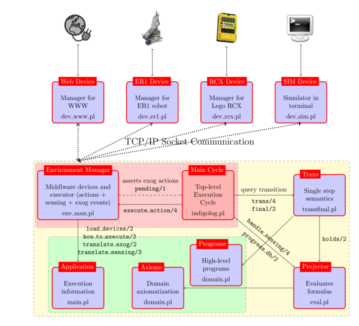

# INDIGOLOG Development Notes

This file documents the INDIGOLOG framework for those interested in further development.

## Main Cycle: `indigolog.pl`

1. Initialization (`initialize(indigolog`))
   1. Initialize Environment Manager (via `initialize(env_manager)`).
   2. Initialize Evaluator Projector (via `initialize(evaluator)`).
   3. Reset INDIGOLOG book-keeping predicates.
2. Main INDIGOLOG Cycle - `indigolog/2`
   1. Process all pending _system_ exogenous actions, e.g., `end_indi` or `debug_indi`.
   2. Incorporate all pending _exogenous_ actions into current history.
   3. Progress current history if needed.
   4. Compute a potential step in current program of type `T`, aborting if exogenous action occurs.
      * Step could be program end (`final`), a transition step (`trans`), exogenous occurrence while computing step (`exog`) or failed program (`failed`).
   5. Depending on step type `T`: (`indigolog/3`)
      1. If `T = final`, the program has been executed to completion, **exit the main cycle**.
      2. If `T = trans`, implement the new step computed, encoded in the new history `H`:
         1. If step did not change the history (e.g., a test step or simulated action `sim(_)`), just continue, do nothin in the step.
         2. If step was a `wait_exog` action, block until an exogenous action is received.
         3. If step was a `trans(A)` action, do not execute anything in the real world but still insert action `A` in the new history. This allows the transition system to add book-keeping actions `A` that are not to be executed in the real world.
         4. Finally, if the step was a domain action `A`, execute it (`indi_execute/3`).
            1. Call environment manager `execute_action/4` to execute the action in the real world.
            2. Call evaluator projector `handle_sensing/4` to incorporate the sensing outcome received to the background theory.
            3. Update the current history using `update_now/1`.
      2. If `T = exog`, it means that the computation was interrupted due to the occurrence of an exogenous action, then restart cycle (step 2).
      3. If `T = failed`, the program has failed to execute a step: **exit main cycle**.
   6. Restart cycle (step 2).
3. Finalize INDIGOLOG (`finalize(indigolog`).
   2. Initialize Evaluator Projector (`initialize(evaluator)`).
   1. Initialize Environment Manager (`initialize(env_manager)`).

### Environment Manager: `env_man.pl`

   4. Reset booking predicates:
      1. `counter_actions/2`
      2. `dev_data/2`
      3. `em_data/3`

### Transition System: 'transfinal.pl`

## Device Managers:  `dev_xxx.pl`

## Projector Evaluator: `eval_xxx.pl`

## Domain Application

## Support Libraries

